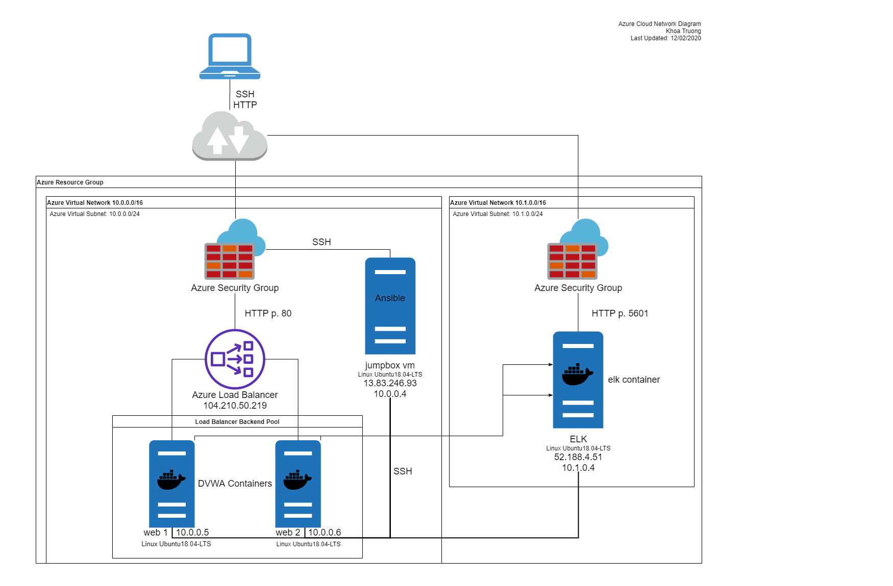
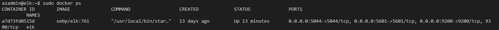

## Automated ELK Stack Deployment

The files in this repository were used to configure the network depicted below.

These files have been tested and used to generate a live ELK deployment on Azure. They can be used to either recreate the entire deployment pictured above. Alternatively, select portions of the `playbook.yaml` file may be used to install only certain pieces of it, such as Filebeat.

This document contains the following details:
- Description of the Topology
- Access Policies
- ELK Configuration
  - Beats in Use
  - Machines Being Monitored
- How to Use the Ansible Build

### Description of the Topology

The main purpose of this network is to expose a load-balanced and monitored instance of DVWA, the D*mn Vulnerable Web Application.

Load balancing ensures that the application will be highly available, in addition to restricting access to the network.

Integrating an ELK server allows users to easily monitor the vulnerable VMs for changes to the files and system logs.

The configuration details of each machine may be found below.

| Name          | Function   | IP Address | Operating System |
|---------------|------------|------------|------------------|
| Jump Box      | Gateway    | 10.0.0.4   | Linux            |
| Web 1         | Web Server | 10.0.0.5   | Linux            |
| Web 2         | Web Server | 10.0.0.6   | Linux            |
| ELK           | ELK Server | 10.1.0.4   | Linux            |

### Access Policies

The machines on the internal network are not exposed to the public Internet. 

Only the Jump Box machine can accept connections from the Internet. Access to this machine is only allowed from the following IP addresses:
- <Personal.Workstation.IP>

Machines within the network can only be accessed by the Jump Box (10.0.0.4).

A summary of the access policies in place can be found in the table below.

| Name     | Publicly Accessible | Allowed IP Addresses           |
|----------|---------------------|--------------------------------|
| Jump Box | Yes                 | <Personal.Workstation.IP>:22                |
| Web 1    | No                  | 10.0.0.4:22                    |
| Web 2    | No                  | 10.0.0.4:22                    |
| ELK      | Yes                 | <Personal.Workstation.IP>:5601, 10.0.0.4:22 |

### Elk Configuration

Ansible was used to automate configuration of the ELK machine. No configuration was performed manually, which is advantageous because it eliminates potential configuration errors among machines and it is much more manageable when applied at scale.

The playbook implements the following tasks:
- configures the memory of the Docker container running on the server intended for the ELK stack
- installs docker and pip3 (prerequisites for installing Docker images)
- downloads and installs `sebp/elk:761` - the ELK image (v. 7.6.1) from Docker
- downloads and installs FileBeat on the webservers

The following screenshot displays the result of running `docker ps` after successfully configuring the ELK instance.

### Target Machines & Beats
This ELK server is configured to monitor the following machines:
- Web 1
- Web 2

We have installed the following Beats on these machines:
- Filebeat

These Beats allow us to collect the following information from each machine:
- `filebeat-7.6.1-*`
  - system logs
  - sudo commands
  - ssh login attempts
  - new users and groups

### Using the Playbook
In order to use the playbook, you will need to have an Ansible control node already configured. Assuming you have such a control node provisioned: 

SSH into the control node and follow the steps below:
- Copy the `playbook.yaml` file to `/etc/ansible/roles/`.
- Update the `playbook.yaml` file to include `hosts: <name of elk server/group>` for the server(s) onto which you will be installing the ELK stack. Similarly, update the value of the `hosts` key to indicate where you will be installing FileBeat.
- Run the playbook, and navigate to `http://<elk.server.ip.address>:5601/app/kibana/` to check that the installation worked as expected.

To only download the playbook, navigate to the directory where you want to save it and run `curl -OL "https://raw.githubusercontent.com/khoaxtru20/elk-stack-on-azure/main/Ansible/playbook.yaml"`